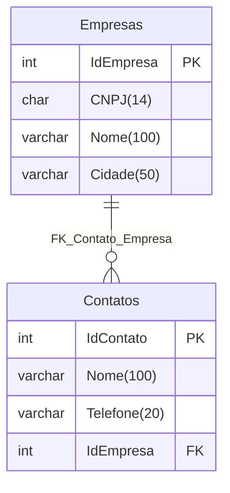
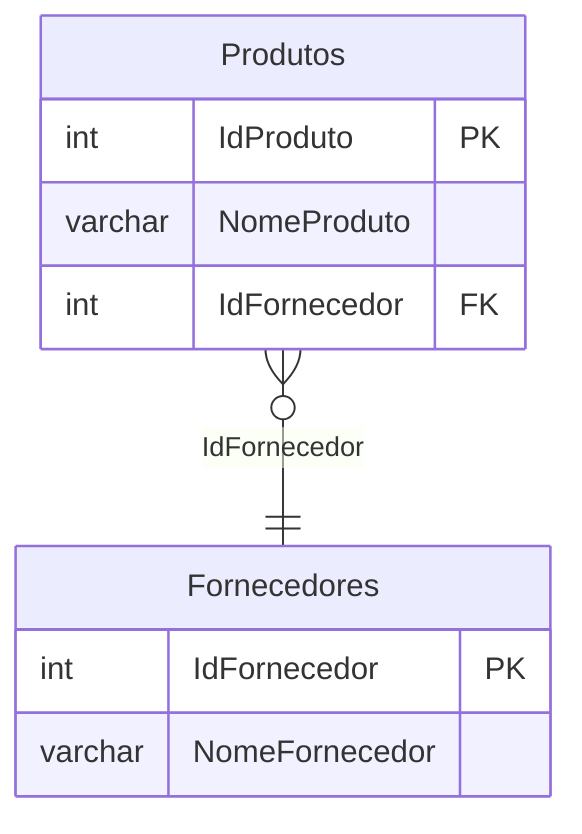
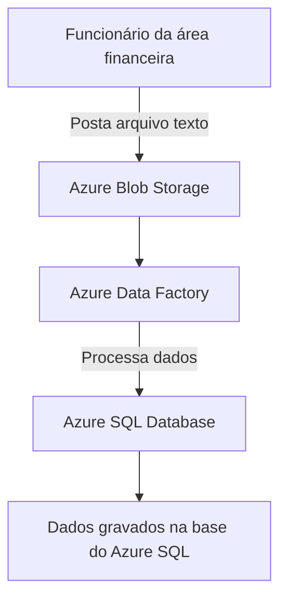
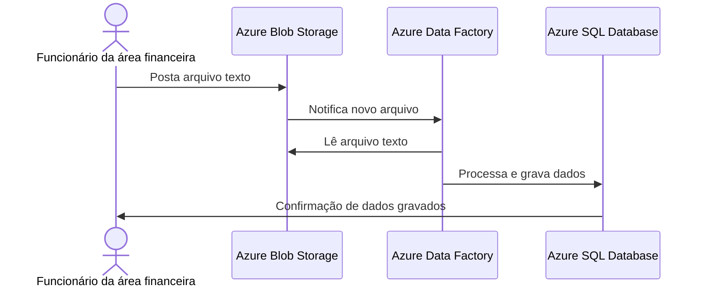

# Mermaid-Copilot_SQLTuesday-2024-12
Materiais da apresentação "IA + Documentação em Bancos de Dados: utilizando GitHub Copilot + Mermaid para gerar diagramas". Palestra realizada durante o SQLTuesday em São Paulo-SP no dia 17/12/2024.

---

Título da apresentação: **IA + Documentação em Bancos de Dados: utilizando GitHub Copilot + Mermaid para gerar diagramas**

Data: **17/12/2024 (terça-feira)**

Tecnologias e tópicos abordados: **GitHub Copilot, Mermaid, Visual Studio Code, GitHub, Documentação de Projetos, PostgreSQL, SQL Server, UML, .NET, Entity Framework, Azure Data Factory...**

Número de participantes: **35 pessoas**

Evento: **SQLTuesday**

Link do evento: [**Microsoft Reactor**](https://developer.microsoft.com/pt-br/reactor/events/24240/)

Link da transmissão: [**YouTube**](https://www.youtube.com/watch?v=2_vlhxP4U1M)

Local: **Microsoft Reactor - Rua Jaceru, 225 - Vila Gertrudes - São Paulo - SP - CEP: 04705-000**

Deixo aqui meus agradecimentos ao **Marcelo Adade (Microsoft MVP)**, à **Larissa Cyganski (Microsoft Reactor)** e ao **Victor Temple (Microsoft Reactor)** por todo o apoio para que eu partipasse como palestrante do **SQLTuesday**.

---


---

## Diagrama de Entidade-Relacionamento

Pergunta ao Copilot:

```text
Gere em Mermaid um diagrama de entidade-relacionamento para o script abaixo:
```

```sql
CREATE DATABASE "basecrmado";

-- Usar o banco de dados
\c "basecrmado";

-- Criar tabela Empresas
CREATE TABLE "Empresas" (
    "IdEmpresa" serial PRIMARY KEY,
    "CNPJ" char(14) NOT NULL,
    "Nome" varchar(100) NOT NULL,
    "Cidade" varchar(50) NOT NULL
);

-- Criar tabela Contatos
CREATE TABLE "Contatos" (
    "IdContato" serial PRIMARY KEY,
    "Nome" varchar(100) NOT NULL,
    "Telefone" varchar(20) NOT NULL,
    "IdEmpresa" int NOT NULL,
    CONSTRAINT "FK_Contato_Empresa" FOREIGN KEY ("IdEmpresa") REFERENCES "Empresas"("IdEmpresa")
);
```

Resultado:



---

## Gerando um  DER a partir de uma query

Pergunta ao Mermaid:

```text
Gere um diagrama de entidade-relacionamento do Mermaid para a consulta a seguir:
```

```sql
SELECT Produtos.IdProduto, Produtos.Nome AS NomeProduto, Fornecedores.IdFornecedor, Fornecedores.Nome AS NomeFornecedor FROM Produtos INNER JOIN Fornecedores ON Produtos.IdFornecedor = Fornecedores.IdFornecedor;
```

Resultado:



## Fluxograma

Pergunta do Copilot:

```text
Gere um fluxograma que represente um processo de ETL utilizando Azure Storage, arquivos no formato texto, processamento com o Azure Data Factory e gravação numa base do Azure SQL. Será um funcionário da área financeira que vai aplicação fará com que o arquivo seja postado em um blob do Azure Storage...
```

Resultado:



## Diagrama de Sequência

Pergunta ao Copilot:

```text
Você poderia converter este último diagrama para o formato de um diagrama de sequência?
```

Resultado:

