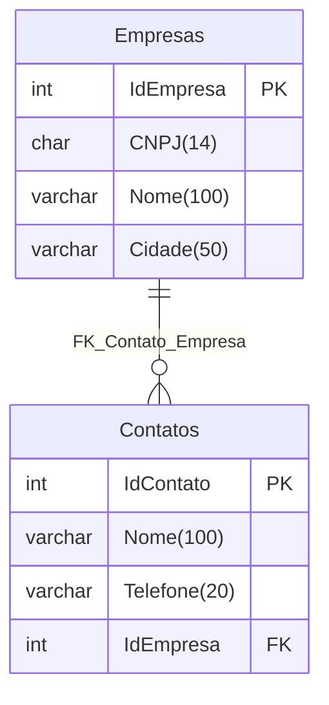

# Mermaid-Copilot_SQLTuesday-2024-12
Materiais da apresentação "IA + Documentação em Bancos de Dados: utilizando GitHub Copilot + Mermaid para gerar diagramas". Palestra realizada durante o SQLTuesday em São Paulo-SP no dia 17/12/2024.

---

## Diagrama de Entidade-Relacionamento

Pergunta ao Copilot:

```text
Gere em Mermaid um diagrama de entidade-relacionamento para o script abaixo:
```

```sql
CREATE DATABASE "basecrmado";

-- Usar o banco de dados
\c "basecrmado";

-- Criar tabela Empresas
CREATE TABLE "Empresas" (
    "IdEmpresa" serial PRIMARY KEY,
    "CNPJ" char(14) NOT NULL,
    "Nome" varchar(100) NOT NULL,
    "Cidade" varchar(50) NOT NULL
);

-- Criar tabela Contatos
CREATE TABLE "Contatos" (
    "IdContato" serial PRIMARY KEY,
    "Nome" varchar(100) NOT NULL,
    "Telefone" varchar(20) NOT NULL,
    "IdEmpresa" int NOT NULL,
    CONSTRAINT "FK_Contato_Empresa" FOREIGN KEY ("IdEmpresa") REFERENCES "Empresas"("IdEmpresa")
);
```

Resultado:

